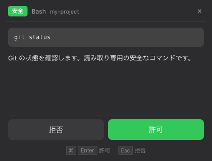
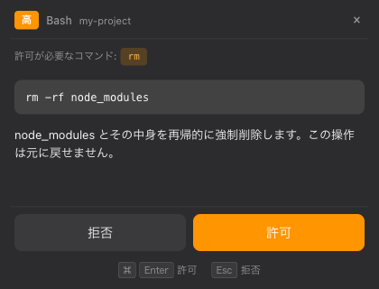
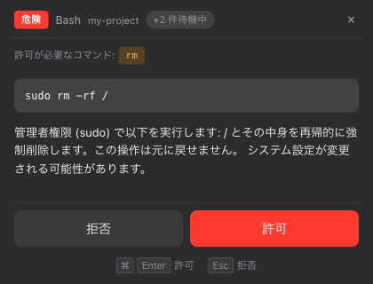
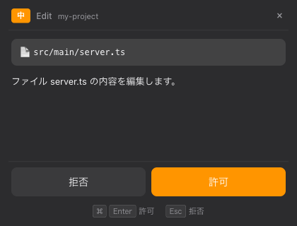
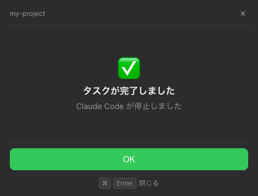
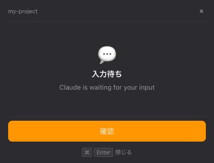

# claude-watch

[English](README.en.md)

Claude Code のツール実行時に macOS メニューバーからパーミッション確認ポップアップと通知を表示する Electron アプリ。

## スクリーンショット

### パーミッション確認ポップアップ

Claude Code がツールを実行する前に、危険度に応じた色分けバッジ付きのポップアップを表示します。

| 安全なコマンド | 危険なコマンド | 最高危険度 (キュー表示) |
|:---:|:---:|:---:|
|  |  |  |
| `git status` など読み取り専用コマンド | `rm -rf` など破壊的コマンド | `sudo` 付きコマンド、待機件数バッジ |

### 非 Bash ツール

Bash 以外のツール (`Edit`, `Write`, `WebFetch`, `MCP` など) にも対応しています。

| Edit ツール |
|:---:|
|  |
| ファイル編集の確認 |

### 通知

タスク完了や入力待ちをリアルタイムで通知します。

| タスク完了 | 入力待ち |
|:---:|:---:|
|  |  |
| Stop フックによる完了通知 (5秒後に自動消去) | Question 通知 (手動で閉じるまで表示) |

## 特徴

- **パーミッションポップアップ** — `Bash`, `Edit`, `Write` など危険なツール実行前に許可/拒否を選択
- **settings.json 権限チェック** — Claude Code の `permissions` (deny/ask/allow) を尊重し、deny → ask → allow の順で評価
- **bypassPermissions 対応** — `--dangerously-skip-permissions` や `defaultMode: "bypassPermissions"` 使用時は全ポップアップを自動スキップ
- **危険度バッジ** — コマンドを自動分析し、5段階 (安全/低/中/高/危険) で色分け表示。ask リストにマッチしたツールは最低 HIGH に引き上げ
- **Bash コマンド AST パース** — tree-sitter-bash でコマンドを構文解析し、パイプ・チェーン内の個別サブコマンドまで正確に権限チェック
- **タスク通知** — Notification / Stop フックによるリアルタイム通知
- **キューイング** — 複数リクエストを順番に処理、待機件数を表示 (パーミッションが通知より優先)
- **キーボードショートカット** — `⌘Enter` で許可、`Esc` で拒否 (ポップアップ表示中のみ有効)
- **非侵入型 UI** — ポップアップはフォーカスを奪わずに表示 (`showInactive`)。フォーカス喪失時は自動スキップし Claude Code のネイティブダイアログにフォールバック
- **多言語対応 (i18n)** — 日本語 / 英語をシステムロケールで自動検出、トレイメニューから手動切り替えも可能
- **ダークモード対応** — macOS のシステムテーマに追従
- **Unix ドメインソケット** — ポート競合なし、所有者のみアクセス可能 (0o700/0o600)
- **graceful degradation** — アプリ未起動時やエラー時は exit(0) で Claude Code のネイティブダイアログにフォールバック

## 必要環境

- macOS
- Node.js 18+
- Claude Code (hooks 機能)

## インストール

### Homebrew (推奨)

```bash
brew install --cask htz/claude-watch/claude-watch
```

### 手動インストール

1. [GitHub Releases](https://github.com/htz/claude-watch/releases) から最新の ZIP をダウンロード
2. 展開して Gatekeeper 属性を除去し、Applications に配置:

```bash
xattr -cr "Claude Watch.app"
mv "Claude Watch.app" /Applications/
```

### フック登録

インストール後、セットアップスクリプトで Claude Code のフックを登録します:

```bash
# 全フック一括登録
node "/Applications/Claude Watch.app/Contents/Resources/hooks/setup.js" --all

# 対話式 (フック種類・対象ツールを個別選択)
node "/Applications/Claude Watch.app/Contents/Resources/hooks/setup.js"

# フック削除
node "/Applications/Claude Watch.app/Contents/Resources/hooks/setup.js" --remove
```

登録後、Claude Watch を起動してください:

```bash
open -a "Claude Watch"
```

## 開発向けセットアップ

ソースコードから開発する場合:

```bash
# 依存パッケージのインストール
npm install

# フックの登録 (対話式メニュー)
npm run setup
```

### セットアップオプション

```bash
# 対話式: フック種類と対象ツールを選択
npm run setup

# 全フック・全ツールを一括登録
npm run setup -- --all

# 全フックを削除
npm run setup -- --remove
```

対話式メニューでは、登録するフックと PreToolUse の対象ツールを個別に選択できます:

```
=== フック選択 ===
  [1] PreToolUse (パーミッション確認ポップアップ) [Y/n]: Y
  [2] Notification (タスク通知)                   [Y/n]: Y
  [3] Stop (タスク完了通知)                       [Y/n]: n

=== PreToolUse 対象ツール ===
  [1] Bash              [Y/n]: Y
  [2] Edit              [Y/n]: Y
  [3] Write             [Y/n]: Y
  [4] WebFetch          [Y/n]: n
  [5] NotebookEdit      [Y/n]: n
  [6] Task              [Y/n]: Y
  [7] MCP tools (mcp__) [Y/n]: Y
```

## 使い方

```bash
# アプリを起動 (メニューバーに常駐)
npm start

# Claude Code を通常通り使用
# → ツール実行時にポップアップが表示される
```

### ポップアップの操作

| 操作 | パーミッション | 通知 |
|---|---|---|
| `⌘Enter` | 許可 | 閉じる |
| `Esc` | 拒否 | 閉じる |
| × ボタン | スキップ (Claude Code に委譲) | 閉じる |
| フォーカス喪失 | スキップ (Claude Code に委譲) | — |

- **許可** — ツールの実行を許可
- **拒否** — ツールの実行を拒否
- **スキップ** — Claude Watch を介さず Claude Code のネイティブダイアログにフォールバック

### タイムアウト

- パーミッション: **5分**で応答がなければ自動拒否
- 通知 (`info`/`stop`): **5秒**後に自動消去
- 通知 (`question`): ユーザーが手動で閉じるまで表示

## 仕組み

```
Claude Code  ──hook──▶  permission-hook.js  ──HTTP──▶  Electron App
                              │                             │
                         Read/Glob/Grep              ポップアップ表示
                         → 自動スキップ               (危険度バッジ付き)
                              │                             │
                         bypassPermissions             ユーザー応答
                         → 全スキップ                       │
                              │                             │
                         settings.json                      │
                         権限チェック                        │
                              │                             │
                         deny → 即拒否                      │
                         ask  → ポップアップへ ────▶        │
                         allow → フォールスルー              │
                         未登録 → ポップアップへ ───▶        │
                              │                             │
                         コマンドインジェクション検知        │
                         → 通知 + フォールスルー             │
                                                           │
Claude Code  ◀─────────  allow / deny / skip  ◀────────────┘
```

1. Claude Code がツールを実行しようとすると、`settings.json` に登録されたフックスクリプトが起動
2. **読み取り専用ツールのスキップ** — `Read`, `Glob`, `Grep` はポップアップ不要として即座にスキップ (exit 0)
3. **bypassPermissions チェック** — 以下のいずれかに該当する場合、全ポップアップをスキップして Claude 本体にフォールスルー:
   - Claude Code が `--dangerously-skip-permissions` で起動 (stdin の `permission_mode` で判定)
   - `permissions.defaultMode: "bypassPermissions"` が設定されている
4. `settings.json` の `permissions` (deny/ask/allow) を **deny → ask → allow** の順で評価:
   - **deny** リストにマッチ → ポップアップなしで即座に拒否 (bypassPermissions でも拒否)
   - **ask** リストにマッチ → ポップアップ表示へ (危険度を最低 HIGH に引き上げ)
   - **allow** リストにマッチ → ポップアップなしで Claude 本体の許可処理にフォールスルー
   - **未登録** → ポップアップ表示へ
5. **Bash コマンドの詳細チェック** — tree-sitter-bash で AST にパースし、個別サブコマンドを抽出:
   - 全サブコマンドが allow にマッチ → 自動許可 (ポップアップなし)
   - 一部のみマッチ → 未許可コマンドをチップ表示してポップアップ
   - コマンドインジェクション検知 (`$()`, `` ` ` ``, `>()`, `$var` 等) → 通知を送り Claude Code に委譲
6. Unix ドメインソケット経由で Electron アプリにリクエスト送信
7. メニューバーからポップアップが表示され、ユーザーが許可/拒否/スキップを選択
8. 応答がフックスクリプト経由で Claude Code に返却される

### 危険度の判定

#### Bash コマンド

コマンド文字列をパターンマッチで5段階に分類。パイプ (`|`) やチェーン (`&&`, `;`) で接続されたコマンドは最も高い危険度を採用:

| レベル | 色 | 代表的なパターン |
|---|---|---|
| SAFE (安全) | 緑 | `ls`, `cat`, `echo`, `git status`, `git log`, `git diff` |
| LOW (低) | 緑 | `npm test`, `git add`, `grep`, `find` |
| MEDIUM (中) | 黄 | `npm install`, `git commit`, `mkdir`, `cp`, `mv`, `node`, 不明なコマンド |
| HIGH (高) | 橙 | `rm -rf`, `git push`, `curl`, `chmod`, `kill`, `docker rm` |
| CRITICAL (危険) | 赤 | `sudo`, `rm -rf /`, `dd of=`, `mkfs`, `chmod 777 /` |

#### 非 Bash ツール

ツール種別ごとに固定の危険度を割り当て:

| レベル | ツール |
|---|---|
| SAFE | `Read`, `Glob`, `Grep` (※ ポップアップ自体をスキップ) |
| LOW | `Task` |
| MEDIUM | `Edit`, `Write`, `NotebookEdit`, MCP ツール, 未知のツール |
| HIGH | `WebFetch` |

### 設定ファイルの読み込み

フックスクリプトは以下の設定ファイルを全てマージして権限チェックを行います (Claude Code 本家と同じ):

| 優先順 | パス | 適用されるリスト | bypassPermissions |
|---|---|---|---|
| 1 | `~/.claude/settings.json` | allow / deny / ask 全て | 有効 |
| 2 | `<project>/.claude/settings.json` | allow / deny / ask 全て | 無視※ |
| 3 | `<project>/.claude/settings.local.json` | allow / deny / ask 全て | 有効 |

※ Git 管理のプロジェクト設定からの `bypassPermissions` は悪意あるリポジトリ対策として無視されます。

deny → ask → allow の評価順序により、deny が常に最優先となります。

### パターンの書式

`permissions` の allow/deny/ask リストで使用するパターン:

| パターン | 説明 | 例 |
|---|---|---|
| `Bash(cmd)` | 完全一致 (前方一致) | `Bash(git status)` → `git status` にマッチ |
| `Bash(cmd:*)` | プレフィックス一致 | `Bash(git:*)` → `git` で始まるコマンド全てにマッチ |
| `Bash(pattern*)` | ワイルドカード | `Bash(npm run *)` → `npm run build` 等にマッチ |
| `Edit` | ツール名完全一致 | `Edit` → Edit ツールにマッチ |
| `mcp__*` | ワイルドカード | `mcp__notion__*` → Notion MCP の全メソッドにマッチ |

Bash パターンはコマンド先頭の環境変数代入 (`NODE_ENV=test npm test` → `npm test`) を除去してから照合されます。

### キューの優先順位

パーミッション要求と通知が同時に発生した場合の表示順序:

1. **パーミッション要求** — 最優先。全て処理されるまで通知は待機
2. **通知** — パーミッションキューが空になった後、FIFO 順で表示

## 開発

```bash
# テスト実行
npm test

# テスト (ウォッチモード)
npm run test:watch

# 手動テスト用スクリプト
./scripts/test-popup.sh safe         # SAFE レベル (ls -la)
./scripts/test-popup.sh high         # HIGH レベル (rm -rf)
./scripts/test-popup.sh critical     # CRITICAL レベル (sudo rm -rf /)
./scripts/test-popup.sh multi        # 3件同時送信
./scripts/test-popup.sh notify       # 完了通知
./scripts/test-popup.sh notify-info  # 入力待ち通知
./scripts/test-popup.sh edit         # Edit ツール
./scripts/test-popup.sh webfetch     # WebFetch ツール
./scripts/test-popup.sh mcp          # MCP ツール
```

## パッケージング

```bash
# .app バンドル作成
npm run package

# DMG/ZIP 作成
npm run make
```

## ライセンス

MIT
